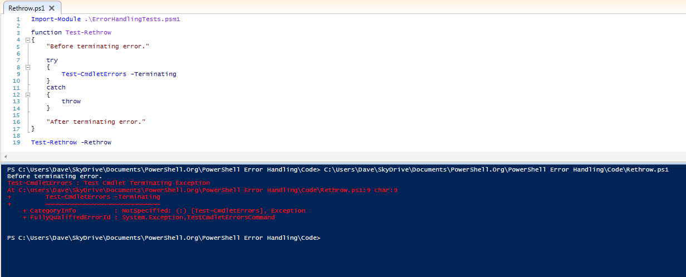

# Analysis of Error Handling Test Results

As mentioned in the introduction, the test code and its output files are available for download. See the "About this Book" section, at the start of this book, for the location. It's quite a bit of data, and doesn't format very well in a Word document, so I won't be including the contents of those files in this ebook. If you question any of the analysis or conclusions I've presented in this section, I encourage you to download and review both the code and results files.

The test code consists of two files. The first is a PowerShell script module (ErrorHandlingTestCommands.psm1) which contains a Cmdlet, a .NET class and several Advanced Functions for producing terminating and non-terminating errors on demand, or for testing PowerShell's behavior when such errors are produced. The second file is the ErrorTests.ps1 script, which imports the module, calls its commands with various parameters, and produces output that was redirected (including the Error stream) to the three results files: ErrorTests.v2.txt, ErrorTests.v3.txt and ErrorTests.v4.txt.

There are three main sections to the ErrorTests.ps1 script. The first section calls commands to generate terminating and non-terminating errors, and outputs information about the contents of $\_ (in Catch blocks only), $Error, and ErrorVariable. These tests were aimed at answering the following questions:

- When dealing only with non-terminating errors, are there differences between how $Error and ErrorVariable present information about the errors that occurred? Does it make any difference if the errors came from a Cmdlet or Advanced Function?
- When using a Try/Catch block, are there any differences in behavior between the way $Error, ErrorVariable, and $\_ give information about the terminating error that occurred? Does it make any difference if the errors came from a Cmdlet, Advanced Function, or .NET method?
- When non-terminating errors happened in addition to the terminating error, are there differences between how $Error and ErrorVariable present the information? Does it make any difference if the errors came from a Cmdlet or Advanced Function?
- In the above tests, are there any differences between a terminating error that was produced normally, as compared to a non-terminating error that occurred when ErrorAction or $ErrorActionPreference was set to Stop?

The second section consists of a few tests to determine whether ErrorAction or $ErrorActionPreference affect terminating errors, or only non-terminating errors.

The final section tests how PowerShell behaves when it encounters unhandled terminating errors from each possible source (a Cmdlet that uses PSCmdlet.ThrowTerminatingError(), an Advanced Function that uses PowerShell's Throw statement, a .NET method that throws an exception, a Cmdlet or Advanced Function that produce non-terminating errors when ErrorAction is set to Stop, and an unknown command.)

The results of all tests were identical in PowerShell 3.0 and 4.0. PowerShell 2.0 had a couple of differences, which will be called out in the analysis.

## Intercepting Non-Terminating Errors

Let's start by talking about non-terminating errors.

### ErrorVariable versus $Error

When dealing with non-terminating errors, there is only one difference between $Error and ErrorVariable: the order of errors in the lists is reversed. The most recent error that occurred is always at the beginning of the $Error variable (index zero), and the most recent error is at the end of the ErrorVariable.

## Intercepting Terminating Errors

This is the real meat of the task: working with terminating errors, or exceptions.

### $\_

At the beginning of a Catch block, the $\_ variable always refers to an ErrorRecord object for the terminating error, regardless of how that error was produced.

### $Error

At the beginning of a Catch block, $Error[0] always refers to an ErrorRecord object for the terminating error, regardless of how that error was produced.

### ErrorVariable

Here, things start to get screwy. When a terminating error is produced by a cmdlet or function and you're using ErrorVariable, the variable will contain some unexpected items, and the results are quite different across the various tests performed:

- When calling an Advanced Function that throws a terminating error, the ErrorVariable contains two identical ErrorRecord objects for the terminating error.In addition, if you're running PowerShell 2.0, these ErrorRecords are followed by two identical objects of type System.Management.Automation.RuntimeException. These RuntimeException objects contain an ErrorRecord property, which refers to ErrorRecord objects identical to the pair that was also contained in the ErrorVariable list. The extra RuntimeException objects are not present in PowerShell 3.0 or later.
- When calling a Cmdlet that throws a terminating error, the ErrorVariable contains a single record, but is not an ErrorRecord object. Instead, it's an instance of System.Management.Automation.CmdletInvocationException. Like the RuntimeException objects mentioned in the last point, CmdletInvocationException contains an ErrorRecord property, and that property refers to the ErrorRecord object that you would have expected to be contained in the ErrorVariable list.
- When calling an Advanced Function with ErrorAction set to Stop, the ErrorVariable contains one object of type System.Management.Automation.ActionPreferenceStopException, followed by two identical ErrorRecord objects. As with the RuntimeException and CmdletInvocationException types, ActionPreferenceStopException contains an ErrorRecord property, which refers to an ErrorRecord object that is identical to the two that were included directly in the ErrorVariable's list.In addition, if running PowerShell 2.0, there are then two more identical objects of type ActionPreferenceStopException, for a total of 5 entries all related to the same terminating error.
- When calling a Cmdlet with ErrorAction set to Stop, the ErrorVariable contains a single object of type System.Management.Automation.ActionPreferenceStopException. The ErrorRecord property of this ActionPreferenceStopException object contains the ErrorRecord object that you would have expected to be directly in the ErrorVariable's list.

## Effects of setting ErrorAction or $ErrorActionPreference

When you execute a Cmdlet or Advanced Function and set the ErrorAction parameter, it affects the behavior of all non-terminating errors. However, it also appears to affect terminating errors produced by the Throw statement in an Advanced Function (though not terminating errors coming from Cmdlets via the PSCmdlet.ThrowTerminatingError() method.)

If you set the $ErrorActionPreference variable before calling the command, its value affects both terminating and non-terminating errors.

This is undocumented behavior; PowerShell's help files state that both the preference variable and parameter should only be affecting non-terminating errors.

## How PowerShell behaves when it encounters unhandled terminating errors

This section of the code proved to be a bit annoying to test, because if the parent scope (the script) handled the errors, it affected the behavior of the code inside the functions. If the script scope didn't have any error handling, then in many cases, the unhandled error actually aborted the script as well. As a result, the ErrorTests.ps1 script and the text files containing its output are written to only show you the cases where a terminating error occurs, but the function still moves on and executes the next command.

If you want to run the full battery of tests on this behavior, import the ErrorHandlingTests.psm1 module and execute the following commands manually at a PowerShell console. Because you're executing them one at a time, you won't run into an issue with some of the commands failing to execute because of a previous unhandled error, the way you would if these were all in a script.
```
Test-WithoutRethrow -Cmdlet -Terminating

Test-WithoutRethrow -Function -Terminating

Test-WithoutRethrow -Cmdlet -NonTerminating

Test-WithoutRethrow -Function -NonTerminating

Test-WithoutRethrow -Method

Test-WithoutRethrow -UnknownCommand
```
There is also a Test-WithRethrow function that can be called with the same parameters, to demonstrate that the results are consistent across all 6 cases when you handle each error and choose whether to abort the function.

### PowerShell continues execution after a terminating error is produced by:

- Terminating errors from Cmdlets.
- .NET Methods that throw exceptions.
- PowerShell encountering an unknown command.

### PowerShell aborts execution when a terminating error is produced by:

- Functions that use the Throw statement.
- Any non-terminating error in conjunction with ErrorAction Stop.
- Any time $ErrorActionPreference is set to Stop in the caller's scope.

In order to achieve consistent behavior between these different sources of terminating errors, you can put commands that might potentially produce a terminating error into a Try block. In the Catch block, you can decide whether to abort execution of the current script block or not. Figure 3.1 shows an example of forcing a function to abort when it hits a terminating exception from a Cmdlet (a situation where PowerShell would normally just continue and execute the "After terminating error." statement), by re-throwing the error from the Catch block. When Throw is used with no arguments inside of a Catch block, it passes the same error up to the parent scope.



Figure 3.1: Re-throwing a terminating error to force a function to stop execution.

## Conclusions

For non-terminating errors, you can use either $Error or ErrorVariable without any real headaches. While the order of the ErrorRecords is reversed between these options, you can easily deal with that in your code, assuming you consider that to be a problem at all. As soon as terminating errors enter the picture, however, ErrorVariable has some very annoying behavior: it sometimes contains Exception objects instead of ErrorRecords, and in many cases, has one or more duplicate objects all relating to the terminating error. While it is possible to code around these quirks, it really doesn't seem to be worth the effort when you can easily use $\_ or $Error[0].

When you're calling a command that might produce a terminating error and you do not handle that error with a Try/Catch or Trap statement, PowerShell's behavior is inconsistent, depending on how the terminating error was generated. In order to achieve consistent results regardless of what commands you're calling, place such commands into a Try block, and choose whether or not to re-throw the error in the Catch block.


