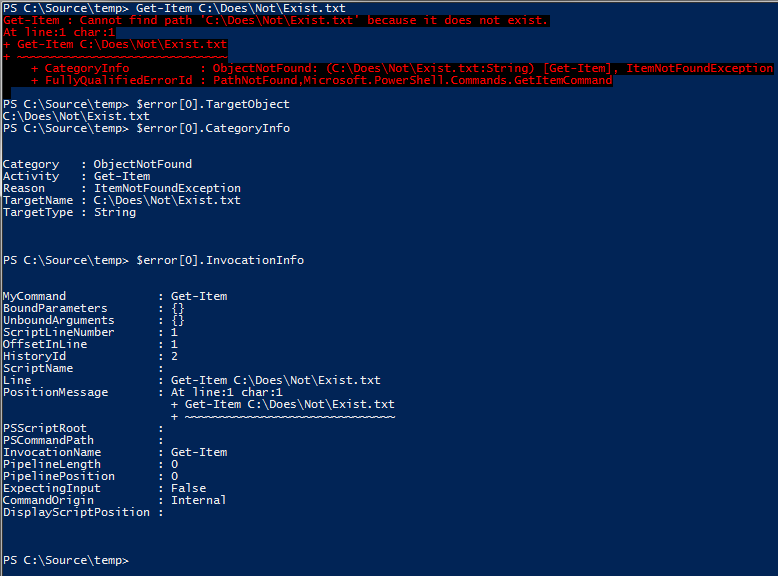

# Powershell Error Handling Basics

Let's start by getting some of the basics out of the way.

## ErrorRecords and Exceptions

In the .NET Framework, on which PowerShell is built, error reporting is largely done by throwing exceptions. Exceptions are .NET Objects which have a base type of [System.Exception](http://msdn.microsoft.com/en-us/library/system.exception(v=vs.110).aspx). These Exception objects contain enough information to communicate all the details of the error to a .NET Framework application (the type of error that occurred, a stack trace of method calls that led to the error, etc.) That alone isn't enough information to provide to a PowerShell script, though; PowerShell has its own stack trace of scripts and function calls which the underlying .NET Framework knows nothing about. It's also important to know which objects had failures, when a single statement or pipeline is capable of producing multiple errors.

For these reasons, PowerShell gives us the ErrorRecord object. ErrorRecords contain a .NET Exception, along with several other pieces of PowerShell-specific information. For example, figure 1.1 shows how you can access the TargetObject, CategoryInfo and InvocationInfo properties of an ErrorRecord object; any one of these might provide information that is useful to your script's error handling logic.



Figure 1.1: Some of the ErrorRecord object's more useful properties.

## Terminating versus Non-Terminating Errors

PowerShell is an extremely _expressive_ language. This means that a single statement or pipeline of PowerShell code can perform the work of hundreds, or even thousands of raw CPU instructions. For example:

Get-Content .\computers.txt | Restart-Computer

This small, 46-character PowerShell pipeline opens a file on disk, automatically detects its text encoding, reads the text one line at a time, connects to each remote computer named in the file, authenticates to that computer, and if successful, restarts the computer. Several of these steps might encounter errors; in the case of the Restart-Computer command, it may succeed for some computers and fail for others.

For this reason, PowerShell introduces the concept of a Non-Terminating error. A Non-Terminating error is one that does not prevent the command from moving on and trying the next item on a list of inputs; for example, if one of the computers in the computers.txt file is offline, that doesn't stop PowerShell from moving on and rebooting the rest of the computers in the file.

By contrast, a Terminating error is one that causes the entire pipeline to fail. For example, this similar command fetches the email addresses associated with Active Directory user accounts:
```
Get-Content .\users.txt |
Get-ADUser -Properties mail |
Select-Object -Property SamAccountName,mail
```
In this pipeline, if the Get-ADUser command can't communicate with Active Directory at all, there's no reason to continue reading lines from the text file or attempting to process additional records, so it will produce a Terminating error. When this Terminating error is encountered, the entire pipeline is immediately aborted; Get-Content will stop reading lines, and close the file.

It's important to know the distinction between these types of errors, because your scripts will use different techniques to intercept them. As a general rule, most errors produced by Cmdlets are non-terminating (though there are a few exceptions, here and there.)

